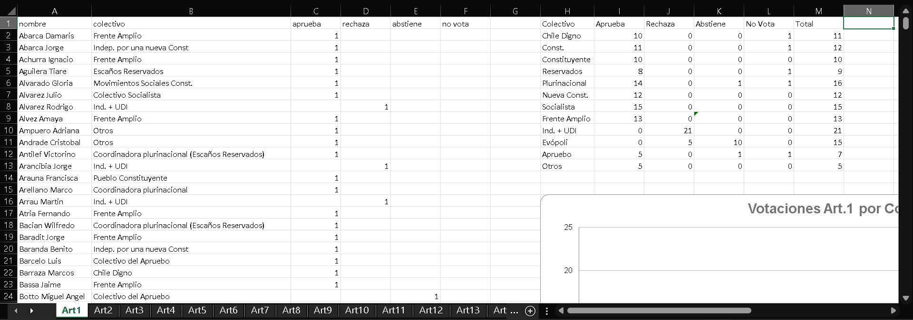
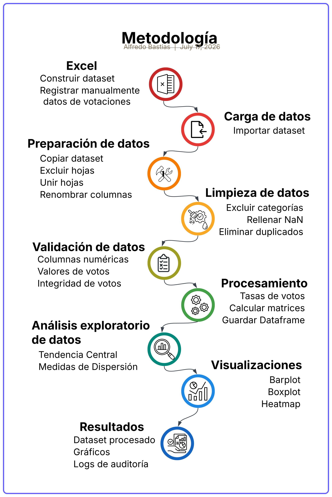
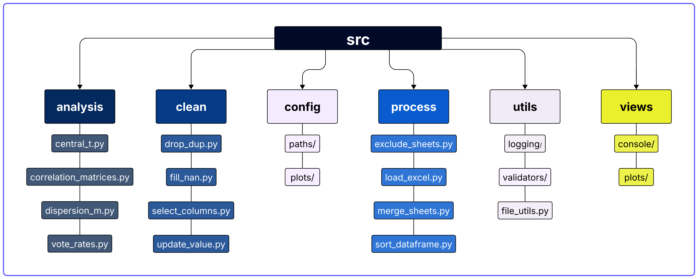
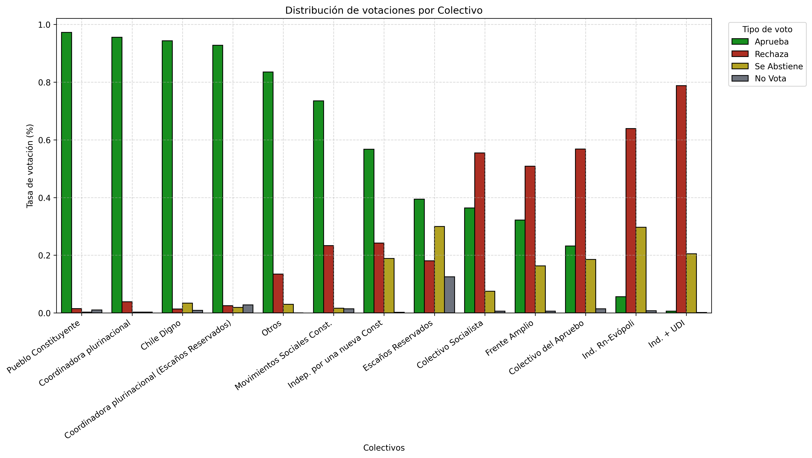
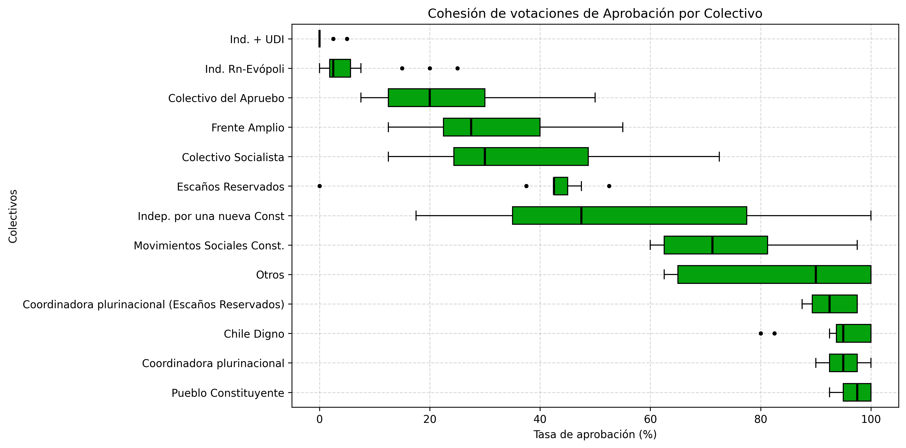
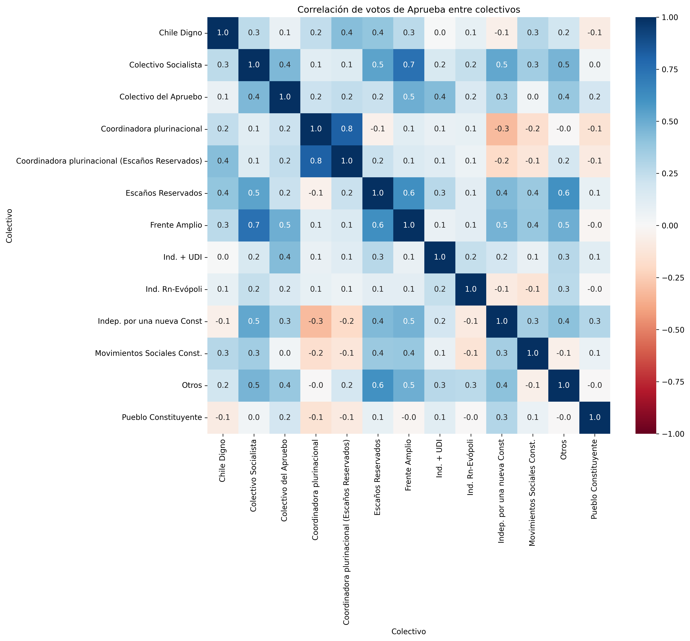

1. Título 
Análisis exploratorio de las votaciones del Primer Informe de Medio Ambiente - 
Convención Constitucional Chile (2022)

2. Contexto
Durante el año 2022, en Chile se llevó a cabo el primer proceso constituyente para redactar una propuesta de Nueva Constitución, a traves de una Convención Constitucional integrada por representantes elegidos a traves de voto popular. Esta convención estuvo integrada por personas provenientes de diversas disciplinas, movimientos sociales, representantes de partidos políticos y pueblos originarios, organizados en distintos colectivos o listas que se formaron para este propósito.

A su vez, junto con las normas elaboradas por los convencionales electos, las organizaciones sociales impulsaron Iniciativas Populares de Norma, las cuales, si reunian el apoyo neceseario podían ser discutidas y posteriormente votadas para ser parte de este texto constitucional.

Este proyecto surge a partir del seguimiento realizado a una de esas iniciativas, sobre la imprescriptibilidad de delitos medioambientales, y debido a la ausencia de una base de datos pública en tiempo real que comunicara los resultados, construí un dataset a partir de un registro manual de cada votación por Artículo, para así poder analizar su comportamiento en los distintos colectivos durante el desarrollo del primer informe de la comisión de medio ambiente.

3. Evolución del proyecto
A medida que las discusiones de la Convención Constitucional avanzaban y se acercaba la fecha de votación,
surgió la necesidad de registrar de manera sistemática el comportamiento de los votos de cada convencional,
con el fin de observar tendencias, responder preguntas específicas y comunicar esos hallazgos.

¿Qué colectivos presentaron una mayor tasa de aprobación frente a iniciativas medioambientales?
¿Qué colectivos rechazaban más iniciativas?
¿Cómo se distribuían las preferencias de voto de cada colectivo?
¿Cómo votaron los convencionales del distrito 7?

Para responder estas preguntas, realicé una recolección manual de datos a partir de las sesiones transmitidas públicamente por la plataforma de Youtube.

Años más tarde (2025), retomé este trabajo en Excel y lo transformé en un proyecto de análisis de datos en Python, aplicando buenas prácticas de programación en la limpieza, procesamiento, validación, análisis y visualización de datos.

En esta nueva etapa, amplié el análisis e incorporé nuevas preguntas:

¿Qué tan cohesionados eran los votos dentro de un mismo colectivo?
¿Qué colectivos presentaban patrones de votación similares?

4. Objetivo
El objetivo del proyecto es construir un pipeline reproducible para limpiar, procesar y analizar datos de votaciones utilizando Python y buenas prácticas de programación, integrando distintas etapas de un flujo de trabajo de un Analista de Datos.

5. Dataset
El conjunto de datos utilizado fue construido manualmente a partir de las votaciones del Primer Informe de Medio Ambiente de la Convención Constitucional de Chile (3 de marzo de 2022).

Registré manualmente el resultado de la votación de artículo a través de capturas de pantallas durante la transmisión en vivo desde su canal oficial en youtube "@Convencioncl". Luego, transcribí esta información a un libro de Excel utilizando una estructura base para todos los Artículos y así facilitar su limpieza, análisis y visualizaciones.

Fuente de los datos: https://www.youtube.com/live/VzBNSL6WlBI?si=SThwoKGeO9nW8L3s&t=25017

Resumen del Dataset:
- 43 hojas excel (40 artículos + complementos)
- 155 Convencionales Constituyentes Únicos
- 12 Colectivos o Listas (+1 categoría "Inhabilitado")

De las 43 hojas, 40 corresponden a votaciones (38 articulos + 2 articulos transitorios) que comparten una estructura común, la cual fue obtenida a partir de la hoja complementaria "Tabla base", diseñada para su duplicación y así registrar otras votaciones en el futuro. 
Además incluye dos hojas complementarias que contienen resumenes: "General" con el resumen consolidado de las votaciones por colectivo, y "Constituyente" con las preferencias de votos por convencional.

En las variables registradas para cada Artículo son representadas en la siguiente tabla:

| Variable    | Tipo       | Descripcion                            |
|-------------|------------|----------------------------------------|
| nombre      | str        | nombre del convencional                |
| colectivo   | str        | nombre del colectivo al cual pertenece |
| aprueba     | int or NaN | 1 si aprueba                           |
| rechaza     | int or NaN | 1 si rechaza                           |
| se abstiene | int or NaN | 1 si se abstiene                       |
| no vota     | int or NaN | 1 si no vota                           |

Dado que cada convencional solo puede emitir un voto por artículo, el registro se realizo marcando la preferencia de voto con el valor [1] y dejando el resto como valores faltantes (NaN), de esta manera también se simplifica significativamente su registro.

Además de estos datos, cada hoja contaba con una tabla resumen que abarca desde la columna H a la columna M con la siguiente información:

| Variable    | Tipo | Descripcion          |
|-------------|------|----------------------|
| colectivo   | str  | nombre del colectivo |
| aprueba     | int  | suma de aprueba      |
| rechaza     | int  | suma de rechaza      |
| se abstiene | int  | suma de se abstiene  |
| no vota     | int  | suma de no vota      |
| total       | int  | suma total de votos  |

### Nota: Para demostrar el funcionamiento de funciones de limpieza y validación de datos, modifique deliberadamente algunos registros del dataset durante el desarrollo para simular algunos errores de calidad (valores fuera de rango, integridad de votos inconsistente). 

6. Metodología
Este proyecto comienza con la recolección manual y registro de las votaciones en un libro de Excel, el cual es importado a Python y procesado en un pipeline que cuenta con una serie de etapas que garantizan la calidad de los datos y los preparan para su análisis y visualizaciones.

El siguiente esquema resume el flujo del proyecto:

Entre las etapas se encuentran:
- Preparación de datos: Excluye las hojas que no corresponden a artículos, unifica las hojas válidas en un único Dataframe, y estandariza su estructura. 
- Limpieza de datos: Excluye categorias irrelevantes como "Inhabilitado", elimina registros duplicados y reemplaza los valores faltantes de las columnas de votación por 0.
- Validación de datos: Comprueba que las columnas de votación sean numéricas, que solo contengan valores [0] o [1], y que cada convencional haya emitido exactamente un voto. En caso de detectar inconsistencias, identifica en que fila y columna se encuentra el dato erróneo para su posterior revisión y actualización. 
- Procesamiento: Calcula las tasas de votación y matrices de correlación que posteriormente son utilizadas en la generación de visualizaciones.
- Análisis exploratorio de datos: Calcula las medidas de tendencia central y de dispersión.
- Visualizaciones: Genera gráficos para visualizar la distribución de votos por colectivo, cohesión de las votaciones por colectivo y la correlación entre colectivos para un tipo de voto.

Los resultados obtenidos tras la ejecución del pipeline son: un archivo Excel con el Dataframe procesado, gráficos de barras, gráficos de cajas y mapas de calor, y un registro de auditoría con la documentación de las principales funciones ejecutadas.

7. Arquitectura
La arquitectura de este proyecto sigue un enfoque modular basado en el principio de responsabilidad única. Cada uno de estos módulos agrupa funciones relacionadas con su respectiva etapa dentro del análisis de datos, favoreciendo de esta manera su mantención, reutilización e incorporación de nuevas funciones.

| Módulo       | Responsabilidad                                                                   |
| ------------ | --------------------------------------------------------------------------------- |
| analysis     | Cálculo de medidas de tendencia central y de dispersión, tasas de votación y matrices de correlación utilizadas en el analisis exploratorio y visualizaciones. |
| clean        | Eliminación de duplicados, rellenando de valores faltantes, actualización de registros inconsistentes y filtrado de categorías. |
| config       | Configuración de rutas de directorios, parámetros predeterminados para visualizaciones, y definición de un set de colores. |
| process      | Carga de datos, copia/exclusión/unión de hojas, agrupación de DataFrame, almacenamiento de datos y otras funciones de procesamiento de datos. |
| utils        | Agrupa funciones de validación de datos, registro de loggings, y utilidades relacionadas la generación de una ruta de salida. |
| views        | Presentación de información en la consola y generación de visualizaciones (barplots, boxplots, heatmaps). | 

El siguiente esquema resume la organización de estos módulos, incluyendo hasta 4 funciones representativas:

Además, seguí las siguientes buenas prácticas que he ido aprendiendo a lo largo de mi formación:

- Arquitectura modular: el proyecto esta dividido en módulos independientes que representan cada etapa del proceso de análisis de datos, facilitando la mantención del código.
- Responsabilidad única: las funciones estan diseñadas para realizar solo una tarea específica.
- Funciones reutilizables: las funciones estan diseñadas para que se puedan reutilizar dentro del mismo pipeline, como tambien en futuros proyectos, facilitando su mantención.
- Configuración desacoplada: las rutas de salida y los parámetros de configuración de visualizaciones, junto con su paleta de colores se encuentran en el módulo config/.
- Pipeline reproducible: el proyecto se puede ejecutar una y otra vez desde los datos originales y obtener el mismo resultado.
- Validaciones de integridad: los registros de las votaciones pasan por un proceso de validación, verificando que las columnas de votación sean numéricas, que los votos únicamente contengan valores válidos (0 o 1) y que cada convencional haya emitido exactamente un voto por artículo.
- Logging: la ejecución de las principales funciones del pipeline registran automáticamente la fecha, hora y un resumen del proceso mediante log_message().
- Factory Method: la función plot_factory() decide que función especializada se va a ejecutar según el respectivo tipo de gráfico (barplot, boxplot o heatmap), como también facilita la incorporación de nuevos gráficos en el futuro.
- Organización tipo paquete: el proyecto es similar a un paquete de Python, lo que permite su reutilización en futuros proyectos de análisis de votaciones.

8. Visualizaciones
Las siguientes visualizaciones desarrolladas permiten responder a las principales preguntas de análisis del proyecto. En la tabla a continuación se presenta un ejemplo representativo de cada tipo de gráfico generado.

| Preguntas de análisis               | Visualización          |  Insight                                 |
|-------------------------------------|------------------------|------------------------------------------|
| ¿Qué colectivos presentaron una     | | Permite comparar la distribución de las  |
| mayor tasa de aprobación frente a   |                        | preferencias de voto entre colectivos,   |
| iniciativas medioambientales?       |                        | ordenados según su tasa de aprobación    |
| ¿Cómo se distribuían las            |                        | para identificar colectivos con mayores  |
| preferencias de voto de cada        |                        | niveles de aprobación y rechazo.         | 
| colectivo?                          |                        |                                          |
|                                     |                        |                                          |  
|                                     |                        | Permite evaluar la dispersión de las     |
| ¿Qué tan cohesionados eran los votos| | tasas de votación entre colectivos por   |
| dentro de un mismo colectivo?       |                        | tipo de voto, así identificar aquellos   |
|                                     |                        | que presentan una mayor cohesión interna,|
|                                     |                        | como también quienes presentan mayores   |
|                                     |                        | diferencias internas al emitir sus votos.|
|                                     |                        |                                          |
|                                     |                        | Permite identificar similitudes y        |
| ¿Qué colectivos presentaban patrones| | diferencias entre los colectivos al      |
| de votación similares?              |                        | emitir un tipo de voto, revelando        |
|                                     |                        | aquellos que poseen patrones de votación |  
|                                     |                        | similares.                               |

9. Resultados

Las mayores tasas de aprobación en las votaciones de iniciativas medioambientales se concentraron en los colectivos Pueblo Constituyente (97,2%), Coordinadora Plurinacional (95,5%), Chile Digno (94,3%) y Coordinadora Plurinacional (Escaños Reservados) (92,8%). 

Por el contrario, las mayores tasas de rechazo hacia estas iniciativas correspondieron a los colectivos Independientes + Unión Demócrata Independiente (78,8%), Independientes Renovación Nacional - Evópoli (63,9%), seguidos del Colectivo del Apruebo (56,7%), Colectivo Socialista (55,4%) y Frente Amplio (50,8%).

Respecto a la cohesión interna, se observan casos de colectivos con una alta cohesión interna y muy baja tasa de aprobación, donde se encuentran Independientes + Unión Demócrata Independiente (IQR = 0 y mediana = 0%) e Independientes Renovación Nacional - Evópoli (IQR = 3,75 y mediana = 2,5%); otro caso que destaca por su alta cohesión interna y una tasa de aprobación cercana al 40% es el colectivo Escaños reservados (IQR = 2,5 y mediana = 42,5%); a estos se suman los colectivos que combinan alta cohesión interna y muy altas tasas de aprobación, tales como Coordinadora Plurinacional (IQR = 5 y mediana = 95%), Pueblo Constituyente (IQR = 5 y mediana = 97,5%) Chile Digno (IQR = 6,25 y mediana = 95%) y Coordinadora Plurinacional (escaños reservados) (IQR = 8,12 y mediana = 92,5%).

Por otra parte, los colectivos que presentaron una mayor dispersión en las tasas de aprobación de sus convencionales fueron Independientes por una nueva Constitución (std = 27,2 y mediana del 47,5%), Otros (std 18,5 y mediana del 90%) y Colectivo Socialista (17,6 y mediana del 30%). Particularmente destaca el colectivo Otros, dado que su alta tasa de aprobación no fue homogénea entre sus convencionales, registrando un IQR de 35 puntos porcentuales.

Tambien se observaron fuertes correlaciones positivas en las tasas de aprobación de los colectivos Coordinadora Plurinacional (escaños reservados) y Coordinadora Plurinacional (≈ 0.8), en el Colectivo Socialista y el Frente Amplio (≈ 0.7). Estos resultados son consistentes con patrones de votación similares y que podrían ser compatibles con posiciones políticas afines.

En contraste, se observaron correlaciones negativas entre Independientes por una nueva Constitución, y los colectivos Coordinadora Plurinacional y Coordinadora Plurinacional (escaños reservados), alcanzando valores cercanos al -0.3 y -0.2 respectivamente. Esto también se observa entre la Coordinadora Plurinacional y Movimientos Sociales Constituyentes, con valores cercanos al -0.2, revelando patrones de votación inversamente relacionados.

Finalmente, con estos hallazgos se puede evidenciar que existen diferentes perfiles de comportamiento entre los diferentes colectivos: 
a. Alta aprobación, alta cohesión: donde se encuentran Coordinadora Plurinacional, Chile Digno, Pueblo Constituyente y Coordinadora Plurinacional (escaños reservados), donde algunos presentaron patrones de votacion similares.
b. Rechazo intermedio (50-55%) y fuerte correlación: posicionandose el Colectivo Socialista y Frente Amplio, con una correlación positiva cercana al 0,7.
c. Alto rechazo y alta cohesión: como son los casos de Independientes + Unión Demócrata Independiente e Independientes Renovación Nacional - Evópoli, con patrones de votación igualmente consistentes.
d. Alta aprobación y alta dispersión interna: destacando el colectivo Otros, que demuestra que una alta tasa de aprobación no necesariamente indica una alta cohesión interna.
e. Posiciones intermedias, alta dispersión: representados por Independientes por una Nueva Constitucion, Movimientos Sociales Constituyentes, entre otros, quienes tambien presentan una menor similitud entre sus preferencias de voto con otros colectivos.

10. Futuras mejoras
Entre las mejoras que me gustaría implementar en el futuro se encuentran las siguientes:

- Clasificación de artículos según su origen (iniciativas populares de norma / iniciativas convencionales de norma) con el objetivo de comparar las tasas de aprobación y observar patrones o tendencias de votación.
- Ampliar el dataset, incorporando las votaciones de otras comisiones de la convención constitucional: 
    a. Sistema Político, Gobierno, Poder Legislativo y Sistema Electoral.
    b. Principios Constitucionales, Democracia, Nacionalidad y Ciudadanía.
    c. Forma de Estado, Ordenamiento, Autonomía, Descentralización, Equidad, Justicia Territorial, Gobiernos Locales y Organización Fiscal.
    d. Derechos Fundamentales.
    e. Sistemas de Justicia, Órganos Autónomos de Control y Reforma Constitucional.
    f .Sistemas de Conocimientos, Culturas, Ciencia, Tecnología, Artes y Patrimonios.
- Desarrollar nuevas visualizaciones que permitan observar la evolución de las tasas de aprobación por artículo, y también comparar las tasas de aprobación de los colectivos según el origen de la iniciativa de norma.
- Construir una base de datos ampliada que reúna las votaciones de las distintas comisiones, y así realizar un análisis integral del proceso constituyente de Chile (2022).

11. Autor
Soy Alfredo Bastías Lagos, Ex-educador diferencial y activista medioambiental, y estoy en un proceso de transición para convertirme en especialista en Análisis de Datos.

Contacto:

LinkedIn: https://www.linkedin.com/in/alfredo-bastias/
GitHub: https://github.com/Pelosaurio/
Correo: alfredo_bastias.91@gmail.com
